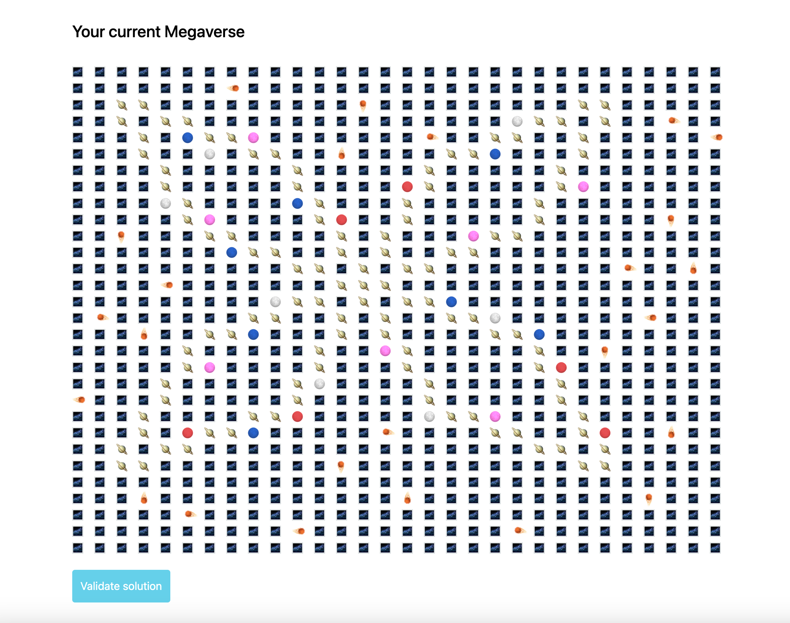

<!-- Improved compatibility of back to top link: See: https://github.com/othneildrew/Best-README-Template/pull/73 -->
<a id="readme-top"></a>
<!--
*** Thanks for checking out the Best-README-Template. If you have a suggestion
*** that would make this better, please fork the repo and create a pull request
*** or simply open an issue with the tag "enhancement".
*** Don't forget to give the project a star!
*** Thanks again! Now go create something AMAZING! :D
-->


<!-- PROJECT SHIELDS -->
<!--
*** I'm using markdown "reference style" links for readability.
*** Reference links are enclosed in brackets [ ] instead of parentheses ( ).
*** See the bottom of this document for the declaration of the reference variables
*** for contributors-url, forks-url, etc. This is an optional, concise syntax you may use.
*** https://www.markdownguide.org/basic-syntax/#reference-style-links
-->
<!-- [![Contributors][contributors-shield]][contributors-url]
[![Forks][forks-shield]][forks-url]
[![Stargazers][stars-shield]][stars-url]
[![Issues][issues-shield]][issues-url]
[![MIT License][license-shield]][license-url]
[![LinkedIn][linkedin-shield]][linkedin-url] -->


<!-- PROJECT LOGO -->
<br />
<div align="center">
  <a href="https://github.com/jhubbardsf/crossmint-technical">
    
  </a>

<h3 align="center">Crossmint Technical</h3>

  <p align="center">
    Technical takehome for Crossmint.io
    <br />
    <br />
    <a href="https://github.com/jhubbardsf/crossmint-technical">View Demo</a>
    ·
    <a href="https://github.com/jhubbardsf/crossmint-technical/issues/new?labels=bug&template=bug-report---.md">Report Bug</a>
    ·
    <a href="https://github.com/jhubbardsf/crossmint-technical/issues/new?labels=enhancement&template=feature-request---.md">Request Feature</a>
  </p>
</div>


<!-- TABLE OF CONTENTS -->
<details>
  <summary>Table of Contents</summary>
  <ol>
    <li>
      <a href="#about-the-project">About The Project</a>
      <ul>
        <li><a href="#built-with">Built With</a></li>
      </ul>
    </li>
    <li>
      <a href="#getting-started">Getting Started</a>
      <ul>
        <li><a href="#prerequisites">Prerequisites</a></li>
        <li><a href="#installation">Installation</a></li>
      </ul>
    </li>
    <li><a href="#usage">Usage</a></li>
    <li><a href="#roadmap">Roadmap</a></li>
    <li><a href="#contact">Contact</a></li>
  </ol>
</details>


<!-- ABOUT THE PROJECT -->
## About The Project

![Product Name Screen Shot][product-screenshot]
![Goal Map][goalmap-screenshot]

This is a command line tool to build out the Crossmint Technical Challenge
Megaverse according outlined in the goal for the phase that the candidate is currently in. It will
populate your map automatically from the goal map and can also destroy the map incase
you want to test building it up and down (note: it will only delete objects that
were placed there according to the goal map).

<p align="right">(<a href="#readme-top">back to top</a>)</p>


### Built With

* [![Bun][Bun.sh]][Bun-url]
* [![Typescript][Typescriptlang.org]][Typescriptlang-url]

<p align="right">(<a href="#readme-top">back to top</a>)</p>


<!-- GETTING STARTED -->
## Getting Started

To get a local copy up and running follow these simple example steps.

### Prerequisites

* Bun
  ```sh
  npm install -g bun
  ```

<p align="right">(<a href="#readme-top">back to top</a>)</p>

### Installation

1. Clone the repo
   ```sh
   git clone https://github.com/jhubbardsf/crossmint-technical.git
   ```
2. Create your `.env` file from example
    ```sh
    cp .env.example .env
   ```
3. Enter your candidateId in `.env`
   ```env
   CANDIDATE_ID='YOUR CANDIDATE ID';
   ```

<p align="right">(<a href="#readme-top">back to top</a>)</p>


<!-- USAGE EXAMPLES -->
## Usage

After following installation instructions you can have the application populate
your megaverse based on your candidate goal map and also destroy the megaverse
to blank out your candidate map.

### Build Megaverse

```sh
bun run src/entry.ts
```

### Destroy Megaverse

```sh
bun run src/entry.ts --destroy
```
or
```sh
bun run src/entry.ts -d
```


<p align="right">(<a href="#readme-top">back to top</a>)</p>


<!-- ROADMAP -->
## Roadmap

- [X] Build out rough app structure
- [X] Get App talking to API
- [X] Test Phase 1
- [X] Extend builder for more shapes for Phase 2
- [X] DRY out code
- [ ] Add some tests
- [ ] Submit


See the [open issues](https://github.com/jhubbardsf/crossmint-technical/issues) for a full list of proposed features (and known issues).

<p align="right">(<a href="#readme-top">back to top</a>)</p>


<!-- CONTACT -->
## Contact

Josh Hubbard - josh@joshuahubbard.dev

Project Link: [https://github.com/jhubbardsf/crossmint-technical](https://github.com/jhubbardsf/crossmint-technical)

<p align="right">(<a href="#readme-top">back to top</a>)</p>


<!-- MARKDOWN LINKS & IMAGES -->
<!-- https://www.markdownguide.org/basic-syntax/#reference-style-links -->
[contributors-shield]: https://img.shields.io/github/contributors/jhubbardsf/crossmint-technical.svg?style=for-the-badge
[contributors-url]: https://github.com/jhubbardsf/crossmint-technical/graphs/contributors
[forks-shield]: https://img.shields.io/github/forks/jhubbardsf/crossmint-technical.svg?style=for-the-badge
[forks-url]: https://github.com/jhubbardsf/crossmint-technical/network/members
[stars-shield]: https://img.shields.io/github/stars/jhubbardsf/crossmint-technical.svg?style=for-the-badge
[stars-url]: https://github.com/jhubbardsf/crossmint-technical/stargazers
[issues-shield]: https://img.shields.io/github/issues/jhubbardsf/crossmint-technical.svg?style=for-the-badge
[issues-url]: https://github.com/jhubbardsf/crossmint-technical/issues
[license-shield]: https://img.shields.io/github/license/jhubbardsf/crossmint-technical.svg?style=for-the-badge
[license-url]: https://github.com/jhubbardsf/crossmint-technical/blob/master/LICENSE.txt
[linkedin-shield]: https://img.shields.io/badge/-LinkedIn-black.svg?style=for-the-badge&logo=linkedin&colorB=555
[linkedin-url]: https://linkedin.com/in/jhubbardsf
[product-screenshot]: images/commandline.png
[goalmap-screenshot]: images/megaverse.png
[Next.js]: https://img.shields.io/badge/next.js-000000?style=for-the-badge&logo=nextdotjs&logoColor=white
[Next-url]: https://nextjs.org/
[React.js]: https://img.shields.io/badge/React-20232A?style=for-the-badge&logo=react&logoColor=61DAFB
[React-url]: https://reactjs.org/
[Vue.js]: https://img.shields.io/badge/Vue.js-35495E?style=for-the-badge&logo=vuedotjs&logoColor=4FC08D
[Vue-url]: https://vuejs.org/
[Angular.io]: https://img.shields.io/badge/Angular-DD0031?style=for-the-badge&logo=angular&logoColor=white
[Angular-url]: https://angular.io/
[Svelte.dev]: https://img.shields.io/badge/Svelte-4A4A55?style=for-the-badge&logo=svelte&logoColor=FF3E00
[Svelte-url]: https://svelte.dev/
[Laravel.com]: https://img.shields.io/badge/Laravel-FF2D20?style=for-the-badge&logo=laravel&logoColor=white
[Laravel-url]: https://laravel.com
[Bootstrap.com]: https://img.shields.io/badge/Bootstrap-563D7C?style=for-the-badge&logo=bootstrap&logoColor=white
[Bootstrap-url]: https://getbootstrap.com
[JQuery.com]: https://img.shields.io/badge/jQuery-0769AD?style=for-the-badge&logo=jquery&logoColor=white
[JQuery-url]: https://jquery.com 
[Bun.sh]: https://img.shields.io/badge/Bun-000000?style=for-the-badge&logo=bun&logoColor=white
[Bun-url]: https://bun.sh
[Typescriptlang.org]: https://img.shields.io/badge/TypeScript-007ACC?style=for-the-badge&logo=typescript&logoColor=white
[Typescriptlang-url]: https://typescriptlang.org

